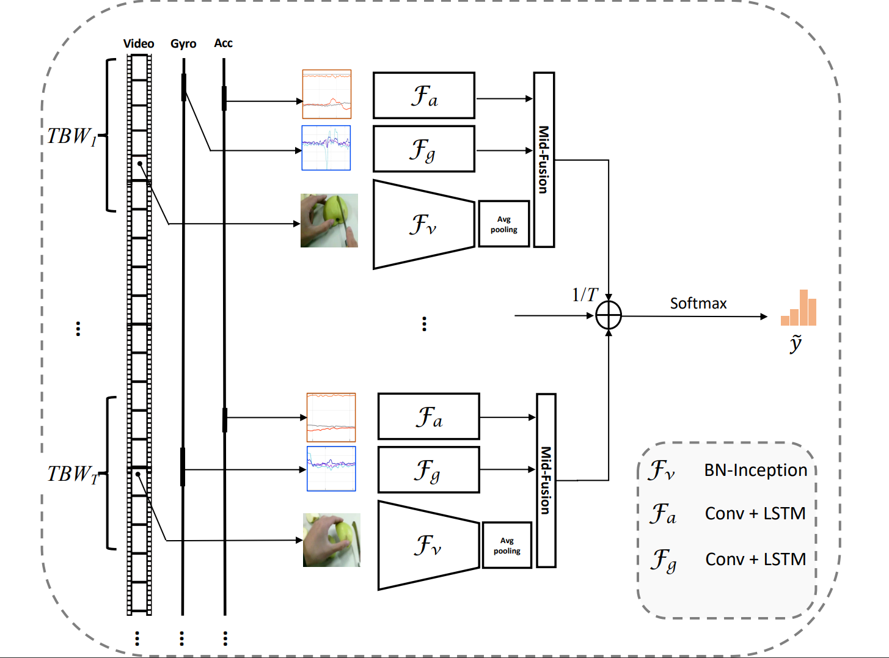

# uestc-mmea-cl
for the dataset uestc-mmea-cl
# UESTC-MMEA-CL -- the new multimodal activity dataset for continual egocentric activity recognition
<div align="center">
  
</div>


## Introduction  

_Our work in the dataset publication paper is mainly based on [_TBN_](https://github.com/ekazakos/temporal-binding-network) and [_PyCIL_](https://github.com/G-U-N/PyCIL) toolbox. It provides a baseline of multimodal continuous learning based on this dataset._

## Installation
* Python 3.6+
* PyTorch 1.7
* CUDA 11.7
* tbqm


1. #### First step, clone the repository and then install it

    

2. #### Before using our program, make sure that the required environment is configured on your host！

   you can see the required packages list in the file [_requirements_](https://github.com/Tflowers-0129/uestc-mmea-cl/blob/main/requirements.txt). 
   just run the code follow can help you to build the required environment：

     ```
     conda install --yes --file requirements.txt 
     ```

3. #### If you want to download the dataset [_UESTC-MMEA-CL_](https://ivipclab.github.io/publication_uestc-mmea-cl/mmea-cl/), Please click this hyperlink. Please ensure that it is used for educational or non-commercial purposes！

    _UESTC-MMEA-CL_ is a new multi-modal activity dataset for continual egocentric activity recognition, which is proposed to promote future studies on continual learning for first-person activity recognition in wearable applications. Our dataset provides not only vision data with auxiliary inertial sensor data but also comprehensive and complex daily activity categories for the purpose of continual learning research. UESTC-MMEA-CL comprises 30.4 hours of fully synchronized first-person video clips, acceleration stream and gyroscope data in total. There are 32 activity classes in the dataset and each class contains approximately 200 samples. We divide the samples of each class into the training set, validation set and test set according to the ratio of 7:2:1.

    The composition of the dataset is as follows:

    ```
    UESTC-MMEA-CL/
          ├── train.txt
          ├── val.txt
          ├── test.txt
          ├── video/
          │  ├── 1_upstairs/
          │  ├──  ...
          │  └── 32_watch_TV/
          └── sensor/
              ├── 1_upstairs/
              ├──  ...
              └── 32_watch_TV/
    
    ```

4. #### Data preprocessing:

   **After downloading the original data set according to the previous step, if you want to get the baseline results, you need to preprocess the data.**

   - Follow the steps in the [hyperlink](https://github.com/ivipclab/Frame-extractor to extract video clips into images at a specific frame rate. Please place the obtained picture in *”./data/"*.
   - No additional preprocessing of sensor data is required and is included in the python code.


## Train  &  Test

Assume that you have activated your virtual environment the code run needed, and make sure the dataset and the pictures you get is stored where the  _data_manager.py_ specifies in the train process.

Before training, please adjust the file ”mydataset_train“, "mydataset_test" and "mydataset_val", change the absolute path in the file:

```python
import os
import random
import numpy as np
from numpy import *

file = 'thepath\\mydataset_val.txt'
with open(file, 'r', encoding='utf-8') as f:
        alllines = f.readlines() 
with open(file, 'w', encoding='utf-8') as f:
        for eachline in alllines:
            eachline = eachline.replace(r'origin_path', 'your_true_dataset_path')
            f.write(eachline)
```

Before training, modify the specific parameters you want to train in the train.sh file, for example:
```
python main.py mydataset RGB Acce Gyro --config ./exps/myfinetune.json --train_list mydataset_train.txt --val_list mydataset_test.txt --mpu_path 'your sensordata path' --arch BNInception --num_segments 8 --dropout 0.5 --epochs 20 -b 8 --lr 0.001 --lr_steps 10 20 --gd 20 --partialbn -j 8
```

After modifying the parameters, you only need to run the following code 
```
sh train1.sh
```
of course, detail information about these parameters in _opts.py_ . you also can change the detail parameters at  _opts.py_ in this project.


## Performance


## Acknowledgement
-  [_TBN_](https://github.com/ekazakos/temporal-binding-network) 
-  [_PyCIL_](https://github.com/G-U-N/PyCIL)

## Citition
If you find the uestc-mmea-cl dataset and code useful in your research, please consider citing:  
```
@ARTICLE{10184468,
  author={Xu, Linfeng and Wu, Qingbo and Pan, Lili and Meng, Fanman and Li, Hongliang and He, Chiyuan and Wang, Hanxin and Cheng, Shaoxu and Dai, Yu},
  journal={IEEE Transactions on Multimedia}, 
  title={Towards Continual Egocentric Activity Recognition: A Multi-Modal Egocentric Activity Dataset for Continual Learning}, 
  year={2023},
  volume={},
  number={},
  pages={1-15},
  doi={10.1109/TMM.2023.3295899}
}
```
